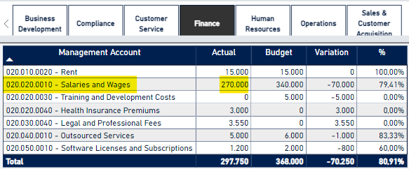
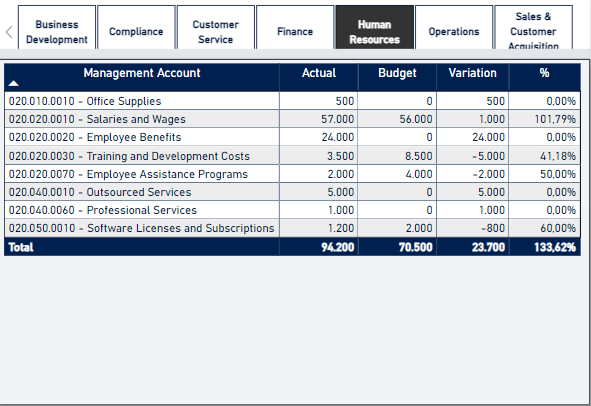
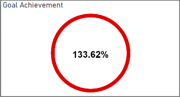
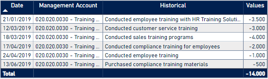

## Analysis of Actual vs. Budget Cost Center for Departments in an E-commerce
This project is an [interactive Power BI dashboard](https://app.powerbi.com/view?r=eyJrIjoiYTVkZmQyMzItNDI2YS00MGNlLTk1OWUtZGFkMjU4YTE0ZWYzIiwidCI6Ijc3YjdkYTEzLTdiNTgtNGRkMi05MTI4LWEyNzhhMjc4MWRhMCJ9) that can be utilized by any data-driven company to monitor and manage costs and expenses in their back-office and front-office areas. This analysis serves as a critical financial indicator used by companies to support their management goals.

This dashboard was built using the following tools:
- **Excel** (data cleaning and treatment);
- **Power BI** (data visualization).

## Business Questions
- Which department has the highest payroll expenses? Which one has the lowest?
- How much did HR department saved during the first quarter?
- How much was spent by the company for training and development initiatives?
  
## Answers and Conclusion

According to an analysis through the table constructed in the dashboard, the sector that most incurs expenses on Salaries is the Finance department. In the first quarter of the year 2019 (the project's reference year), the team has already spent $270,000 USD. The second department that spends the most is a tie between Sales and Accounting, both of which had expenses of $150,000 USD in the first quarter.

The HR department was one of the sectors that exceeded the agreed budget at the beginning of the year. Therefore, there were no cost savings as the question presupposed.
The accounts that contributed the most to the goal not being well, were Employee Benefits and Outsourced Professionals because, in both cases, there were expenses but no provision was made for these expenses. The final result, as stated in the image above, was 133.62% of the budget.

In the second page of the dashboard, we have the breakdown of all cost/expense entries in the company's 1Q. Thus, to answer the second question, we will use this table.
When combining the expenses from all areas of the company, it is observed that approximately $14,000 USD was spent on training and development, with expenses divided among the Sales, HR, and Compliance departments.
