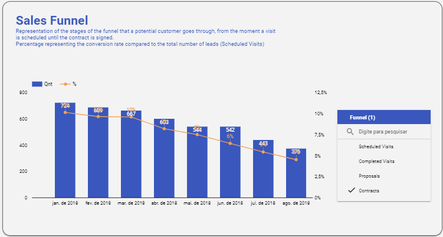
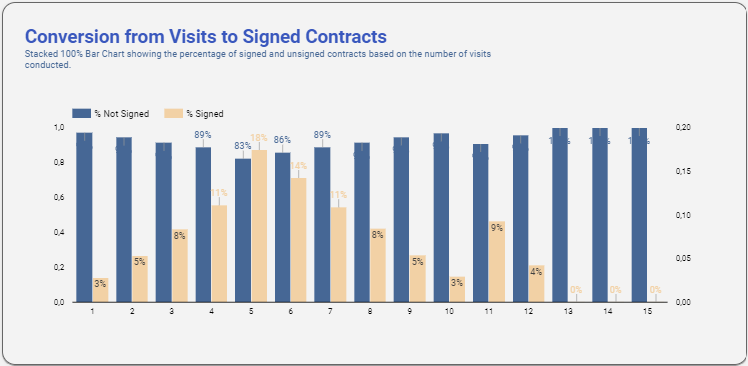
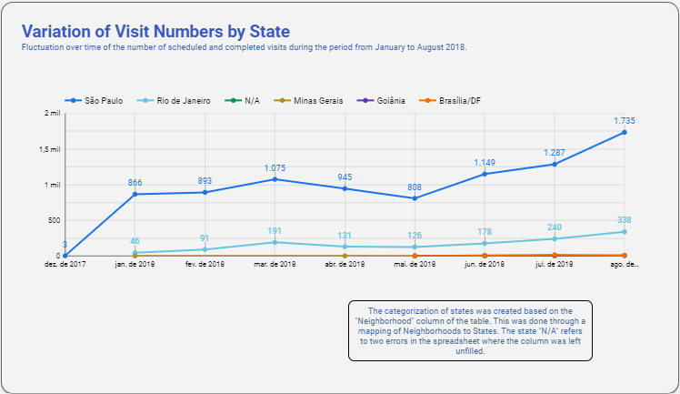
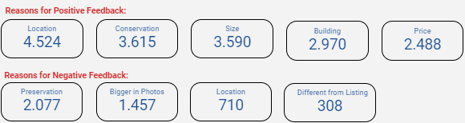

## Business Analysis of a Proptech Company
This project is an [interactive Looker Studio dashboard](https://lookerstudio.google.com/reporting/8c8084c4-de29-4d9b-aeaf-e582c2ab9f23/page/QHAID) that provides an overall analysis of a proptech, where data on the company's sales funnel issues is gathered and linked to a database of lead feedback. The company aims to have a general overview of where the issues lie and what actions to take to address them.

This dashboard was built using the following tools:
- **Google Sheets** (data cleaning and treatment);
- **Looker Studio** (data visualization).

## Business Questions
- According to the provided sales funnel, what is the main issue/problem of the company?
- On average, how many visits does a lead require to close a contract?
- Which region of the country is most sought after by customers within the application?
- What are the main positive reasons mentioned by visitors? And the negative ones?

## Answers and Conclusion

We can observe a gradual increase month after month in both the number of scheduled visits and, especially, the number of actual visits that are realized. However, the same trend is not reflected in the bottom of the funnel, where the contract with the client is finalized and signed. Therefore, it is evident that while visits are increasing, the number of contracts is decreasing, exposing a flaw in the effectiveness of lead-to-customer conversion. According to the database, the average conversion rate during the analyzed period of 2018 was 6%.

Based on the Conversion of Visits to Signed Contracts chart, we noticed that the alignment between the app/website offering and what the lead is actually seeking was not being achieved. According to the provided data, the lead typically becomes a customer between the 4th and 7th visit. This reinforces the need for improvement in the bottom of the sales funnel

A line chart was created using the provided visit table as the basis. The "state" column was used as the metric to understand where the visits occur the most. As a result, it was evident that the majority of visits take place in the Southeast region of Brazil, with a focus on São Paulo and Rio de Janeiro.

Finally, big number cards were created to highlight the main arguments of visitors, both positive and negative.
On the positive side, the aspects that caught the attention of leads were the location, condition, and size of the property.
On the negative side, the primary areas of concern and improvement are the preservation of some properties and the fact that the property appeared larger and bigger in the app/site where the lead found it than in reality.
