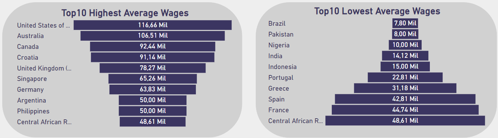
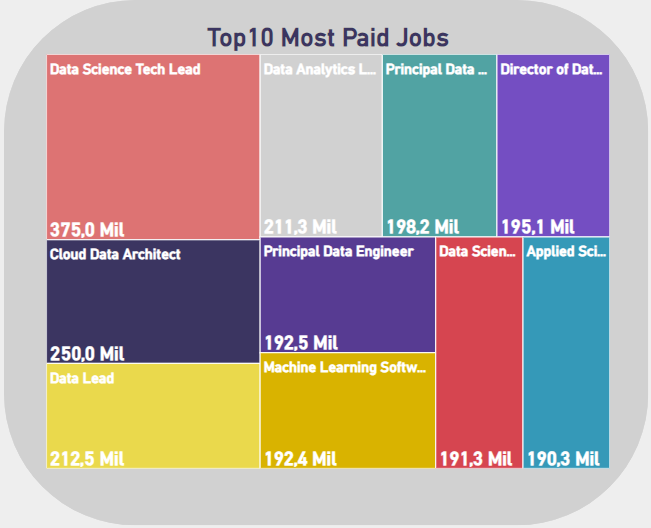
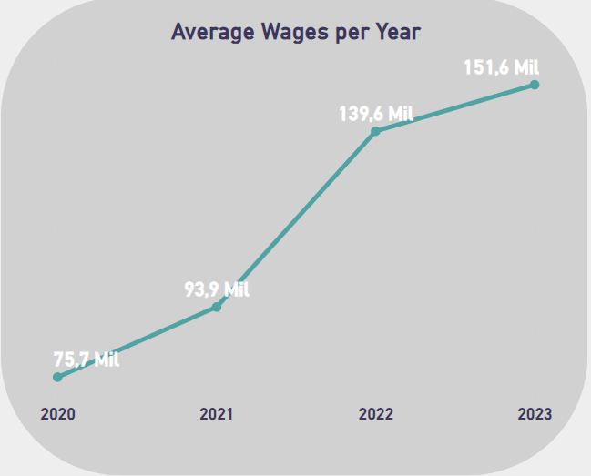

## Salary Study on Data Science Professions Worldwide
This project is an [interactive Power BI dashboard](https://app.powerbi.com/view?r=eyJrIjoiZDYwYjJhNWEtOWVmOC00MThmLTlhYmMtYzU1ZmJkODg0MzIyIiwidCI6Ijc3YjdkYTEzLTdiNTgtNGRkMi05MTI4LWEyNzhhMjc4MWRhMCJ9) This project is an interactive Power BI dashboard that provides an overview of technology jobs over the past years. The dashboard allows users to analyze information such as average salary, number of employees in each jobs, and work arrangements (remote, on-site, or hybrid).

This dashboard was built using the following tools:
- **Excel** (data cleaning and treatment);
- **Power BI** (data visualization).

## Business Questions
- What are the top 10 countries with the highest/lowest average salaries for Data Analysts?
- What are the highest-paying jobs in the technology field?
- Which type of work (remote, on-site, or hybrid) is more common in tech jobs?
- Is the average wage for Data Engineers increasing or decreasing over the years?

## Answers and Conclusion

According to the image above, for this response, I opt for funnel charts. The highest average salaries among Data Analysts are concentrated in companies from the United States, Australia, and Canada, while the countries with the lowest compensation for these analysts are Brazil, Pakistan, and Nigeria.

I used a chart to visually demonstrate and label the highest-paying technology professions in the market based on this research. It is evident that these professions are leadership roles, more strategic in nature, such as Data Science Tech Lead, Data Lead, and Cloud Data Architect.

Cards were utilized to answer this question. There is a significant balance between remote and on-site work in the technology field, as shown in the image. This balance can be mainly attributed to the fact that many of the positions are filled by foreign professionals, such as those residing in Brazil but working for American companies.

Lastly, for the last question, a line chart was used, as it is perfect for temporal analysis. Thus, the chart below demonstrates that since 2020, according to the research, the average salary for Data Engineers has been increasing year after year, with a notable leap from 2021 to 2022, where the average went from 93.9k USD to 139.6k USD, equivalent to almost a 50% increase.
